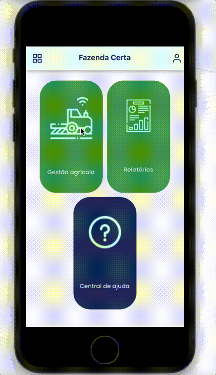
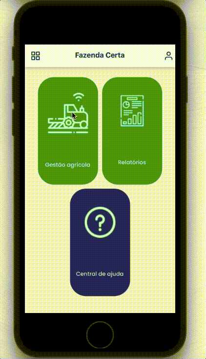
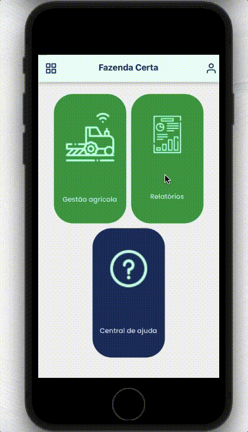

Mudar para [português](https://github.com/Danilo-Js/My_Experience/tree/main/Easyfarm/portuguese.md)

# Easyfarm

  <a href="#iphone-about-the-project">About the project</a>&nbsp;&nbsp;&nbsp;|&nbsp;&nbsp;&nbsp;
  <a href="#rocket-technologies">Technologies</a>&nbsp;&nbsp;&nbsp;|&nbsp;&nbsp;&nbsp;
  <a href="#balloon-modules">Modules</a>

## :iphone: About the project

EasyFarm's mission is to organize all farm information in one place, making it possible to manage a farm in a complete, simple, and organized way.
This management is done through the modules: Agricultural Activity, Supply, Inventory, Maintenance, Service Orders, Purchases, and Rainfall.
There is also the generation of reports for each of the modules.

## :rocket: Technologies

To write the code:
-  [VS Code][vc] with [EditorConfig][vceditconfig], [ESLint][vceslint] and [Prettier][vcprettier]

#### The code itself
-  [React Navigation 5.x](https://reactnavigation.org/docs/5.x/getting-started)
    - react-navigation/stack
    - react-navigation/native
    - react-navigation/material-bottom-tabs
    - react-navigation/drawer
-  [React-Native](https://facebook.github.io/react-native/)
-  [Gesture Handler](https://kmagiera.github.io/react-native-gesture-handler/)
-  [Safe-Area-Context](https://github.com/th3rdwave/react-native-safe-area-context)
-  [Screens](https://github.com/software-mansion/react-native-screens)
-  [Exception-Handler](https://github.com/a7ul/react-native-exception-handler)
-  [Responsive-Screen](https://github.com/marudy/react-native-responsive-screen)
-  [MaskedView](https://github.com/react-native-community/react-native-masked-view)
-  [AsyncStorage](https://github.com/react-native-community/async-storage)
-  [Styled-Components](https://www.styled-components.com/)
-  [Axios](https://www.npmjs.com/package/react-native-axios)
-  [Reanimated](https://github.com/software-mansion/react-native-reanimated)
-  [Vector-Icons](https://github.com/oblador/react-native-vector-icons)
-  [WebView](https://github.com/react-native-community/react-native-webview)
-  [DateTimePicker](https://github.com/react-native-datetimepicker/datetimepicker)
-  [DatePicker](https://github.com/henninghall/react-native-date-picker)
-  [DocumentPicker](https://github.com/rnmods/react-native-document-picker)
-  [Redux & Redux-Persist](https://https://redux.js.org/introduction/getting-started)
-  [NetInfo](https://github.com/react-native-netinfo/react-native-netinfo)
-  [Date-Fns](https://github.com/date-fns/date-fns)
-  [Canvas](https://github.com/iddan/react-native-canvas)
-  [Crisp-Chat-Sdk](https://github.com/walterholohan/react-native-crisp-chat-sdk)
-  [Paper](https://reactnativepaper.com)
-  [Pie-Chart](github.com/genexu/react-native-pie-chart)
-  [Fetch-Blob](https://github.com/wkh237/react-native-fetch-blob)
-  [Portalize](https://github.com/jeremybarbet/react-native-portalize)
-  [Modalize](https://github.com/jeremybarbet/react-native-portalize)
-  [Moment](https://momentjs.com)

## :balloon: Modules
##### This is a video gallery. Click on the module name to watch the video!

#### [Login](https://mega.nz/embed/8pllXbpB#7NvnnT-Ul4gtQtKB3zFxtZzV7LC7T2AfYNx_rD9EkZQ)

#### [Menus](https://mega.nz/embed/Mt9VSDZL#CSsENOemYXQSI1Qb3oPvA9Ciy-spSk1PuA1ep-5Qa6s)

#### [Agricultural Activity](https://mega.nz/embed/t80H2ZZJ#S17zmTEd3rbvRobc3v-TsxZ5n3aejsiqLY57tWdrt1I)

#### [Stock Transfer](https://mega.nz/embed/8x8WEBwR#A9yeobAqQXu5j4ALQrkdQCKjsQcWQGAmjmBD7BC70zg)

#### [Order of Service](https://mega.nz/embed/l00XjbJR#gGh7tReVVZWMHJpBd4JPmop-pUOQ9peJqg2KUaTXOVM)

#### [Rainfall](https://mega.nz/embed/o4VTFRwQ#EoRMHeHADuTFD8cXsTp4OUZmy4JJw8ITrZmxm6HeVrc)

#### [Maintenance](https://mega.nz/embed/IgFDHbCL#DxQeA-j2HwSL8GI5PZT61sxsF3wuL0hYNhJh29QIYt8)

#### [Supply](https://mega.nz/embed/Msc01RAL#uzz1eUf1al4DNrh3-qiBmrXQdQD-0Q2g0e2_n1eQqek)

#### [Supply Report](https://mega.nz/embed/Fp1TBKob#eo2g3_thnT-gfn2ltnM9EFrZciFkEMfuOEaJzlXFHqk)

#### [Purchasing Report](https://mega.nz/embed/c81FUKSK#89z3MvJKQHxEXLXGYouq2U_C45ZmlIPh7Tio4eL2pMk)

#### [Rainfall Report](https://mega.nz/embed/YgNTFbJK#3xRITlQ9h3lwCmJVHZv_pLPq1t5ICyOQWOXbZvamExw)

#### [Financial report](https://mega.nz/embed/lxlkwaja#d-FW_LaPC1dHGkoF9Fv59hNCbzQDduOQ_3dJYWtkWW4)

---

#### Made by Danilo José Lima de Oliveira ♥ 
#### [Get in touch!](https://www.linkedin.com/in/danilo-js/) with me 

[vc]: https://code.visualstudio.com/
[vceditconfig]: https://marketplace.visualstudio.com/items?itemName=EditorConfig.EditorConfig
[vceslint]: https://marketplace.visualstudio.com/items?itemName=dbaeumer.vscode-eslint
[vcprettier]: https://marketplace.visualstudio.com/items?itemName=esbenp.prettier-vscode