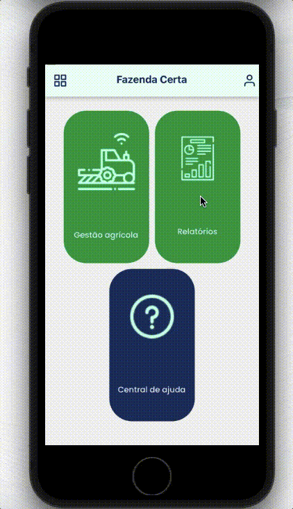

# Easyfarm

## :iphone: About the project

EasyFarm's mission is to organize all farm information in one place, enabling comprehensive, simplified, and organized farm management. 

This management is facilitated through modules including Agricultural Activity, Supply, Inventory, Maintenance, Service Orders, Purchases, and Rainfall. Each module has report generation capabilities. 

The frontend of EasyFarm was developed using React Native, and as the main developer, I have crafted and implemented these features to ensure an optimal user experience.

## 🎞️ Easyfarm – GIF Showcase

<table>
  <tr>
    <td align="center">
       
      <strong>Menus</strong>
    </td>
    <td align="center">
       
      <strong>Agricultural Activity</strong>
    </td>
    <td align="center">
       
      <strong>Supply</strong>
    </td>
  </tr>
  <tr>
    <td align="center">
       
      <strong>Maintenance</strong>
    </td>
    <td align="center">
       
      <strong>Work Order</strong>
    </td>
    <td align="center">
       
      <strong>Precipitation</strong>
    </td>
  </tr>
  <tr>
    <td align="center">
       
      <strong>Supply Report</strong>
    </td>
    <td align="center">
       
      <strong>Purchases Report</strong>
    </td>
    <td align="center">
       
      <strong>Accounts Payable</strong>
    </td>
  </tr>
  <tr>
    <td align="center">
       
      <strong>Precipitation Report</strong>
    </td>
    <td align="center">
       
      <strong>Stock Transfer</strong>
    </td>
  </tr>
</table>

## :rocket: Technologies

To write the code:
-  [VS Code][vc] with [EditorConfig][vceditconfig], [ESLint][vceslint] and [Prettier][vcprettier]

#### The code itself
-  [React Navigation 5.x](https://reactnavigation.org/docs/5.x/getting-started)
    - react-navigation/stack
    - react-navigation/native
    - react-navigation/material-bottom-tabs
    - react-navigation/drawer
-  [React-Native](https://facebook.github.io/react-native/)
-  [Gesture Handler](https://kmagiera.github.io/react-native-gesture-handler/)
-  [Safe-Area-Context](https://github.com/th3rdwave/react-native-safe-area-context)
-  [Screens](https://github.com/software-mansion/react-native-screens)
-  [Exception-Handler](https://github.com/a7ul/react-native-exception-handler)
-  [Responsive-Screen](https://github.com/marudy/react-native-responsive-screen)
-  [MaskedView](https://github.com/react-native-community/react-native-masked-view)
-  [AsyncStorage](https://github.com/react-native-community/async-storage)
-  [Styled-Components](https://www.styled-components.com/)
-  [Axios](https://www.npmjs.com/package/react-native-axios)
-  [Reanimated](https://github.com/software-mansion/react-native-reanimated)
-  [Vector-Icons](https://github.com/oblador/react-native-vector-icons)
-  [WebView](https://github.com/react-native-community/react-native-webview)
-  [DateTimePicker](https://github.com/react-native-datetimepicker/datetimepicker)
-  [DatePicker](https://github.com/henninghall/react-native-date-picker)
-  [DocumentPicker](https://github.com/rnmods/react-native-document-picker)
-  [Redux & Redux-Persist](https://https://redux.js.org/introduction/getting-started)
-  [NetInfo](https://github.com/react-native-netinfo/react-native-netinfo)
-  [Date-Fns](https://github.com/date-fns/date-fns)
-  [Canvas](https://github.com/iddan/react-native-canvas)
-  [Crisp-Chat-Sdk](https://github.com/walterholohan/react-native-crisp-chat-sdk)
-  [Paper](https://reactnativepaper.com)
-  [Pie-Chart](github.com/genexu/react-native-pie-chart)
-  [Fetch-Blob](https://github.com/wkh237/react-native-fetch-blob)
-  [Portalize](https://github.com/jeremybarbet/react-native-portalize)
-  [Modalize](https://github.com/jeremybarbet/react-native-portalize)
-  [Moment](https://momentjs.com)

---

#### Made by Danilo José Lima de Oliveira ♥ 
#### [Get in touch!](https://www.linkedin.com/in/danilo-js/) with me 

[vc]: https://code.visualstudio.com/
[vceditconfig]: https://marketplace.visualstudio.com/items?itemName=EditorConfig.EditorConfig
[vceslint]: https://marketplace.visualstudio.com/items?itemName=dbaeumer.vscode-eslint
[vcprettier]: https://marketplace.visualstudio.com/items?itemName=esbenp.prettier-vscode
