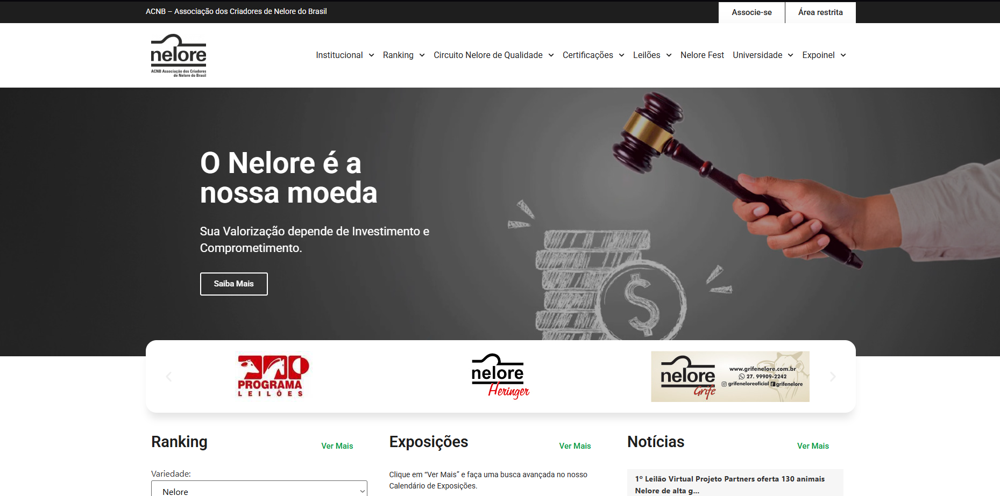
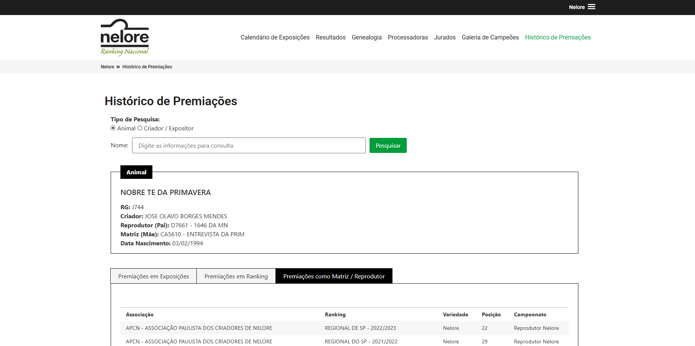

# Veon Casa

## :iphone: About the project

The Nelore project is a PHP and WordPress-based website that I contributed to by being responsible for the development of custom plugins. This site belongs to the "Associação de Criadores Nelore do Brasil" and involved the recreation of an existing legacy project. It features a variety of functionalities and provides extensive information for Nelore cattle breeders.

## 📸 Gallery

<table>
  <tr>
    <td align="center">
       
    </td>
    <td align="center">
       
    </td>
  </tr>
</table>

  

---

#### Made by Danilo José Lima de Oliveira ♥ 
#### [Get in touch!](https://www.linkedin.com/in/danilo-js/) with me 

[vc]: https://code.visualstudio.com/
[vceditconfig]: https://marketplace.visualstudio.com/items?itemName=EditorConfig.EditorConfig
[vceslint]: https://marketplace.visualstudio.com/items?itemName=dbaeumer.vscode-eslint
[vcprettier]: https://marketplace.visualstudio.com/items?itemName=esbenp.prettier-vscode