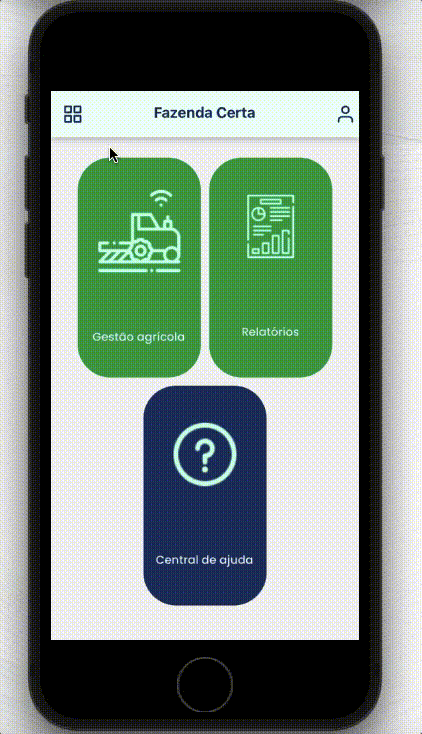
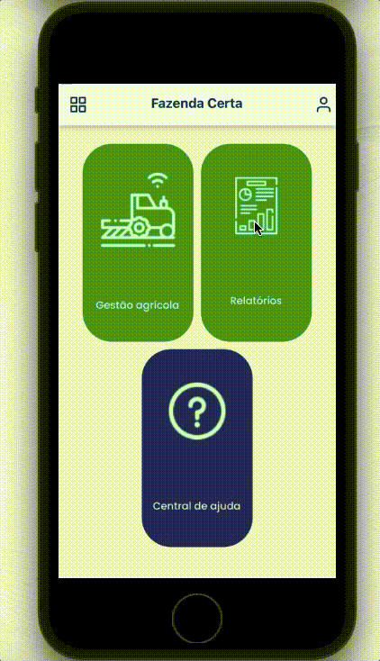
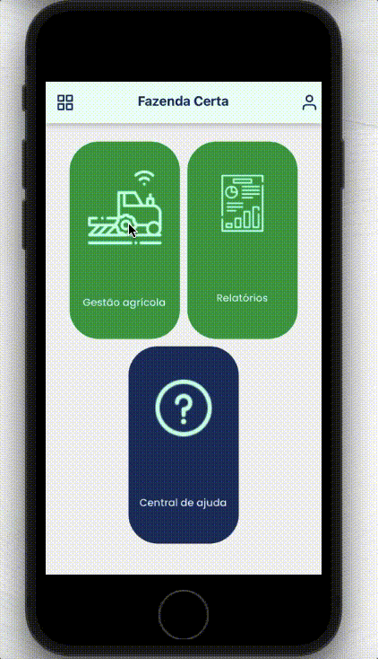
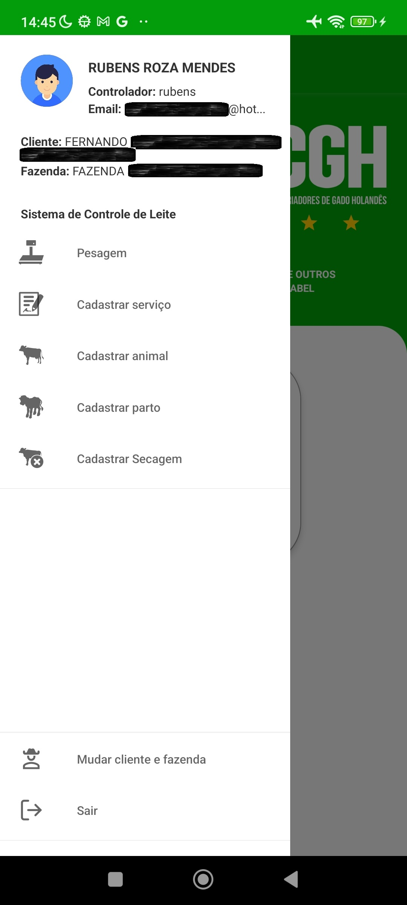
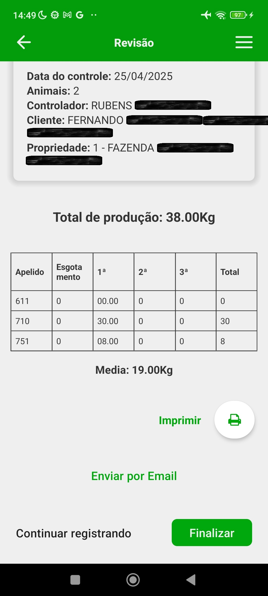
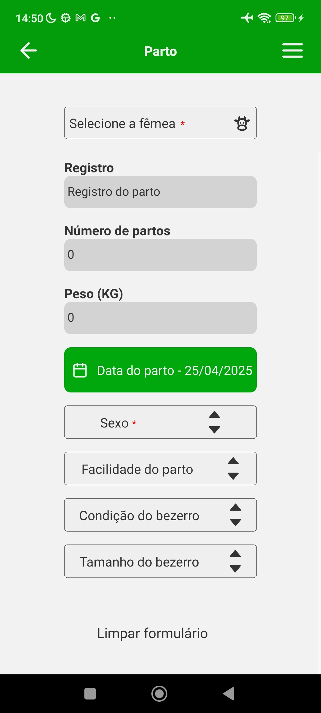
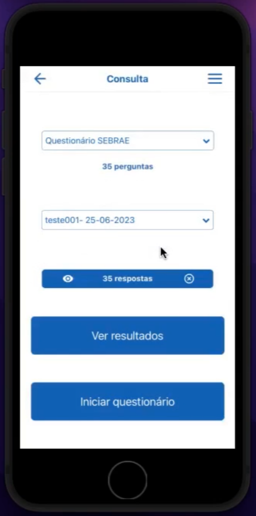
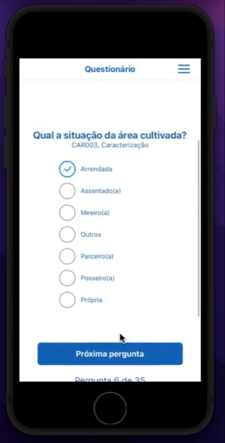
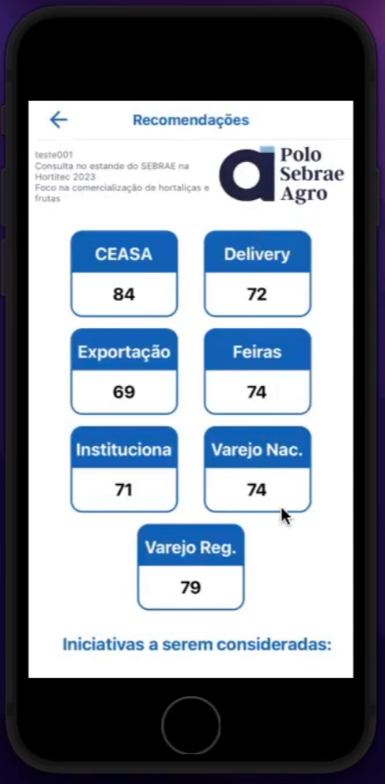

# My experience

  <a href="#easyfarm">Easyfarm</a>&nbsp;&nbsp;&nbsp;|&nbsp;&nbsp;&nbsp;
  <a href="#scl">SCL</a>&nbsp;&nbsp;&nbsp;|&nbsp;&nbsp;&nbsp;
  <a href="#sebraeapp">SebraeApp</a>&nbsp;&nbsp;&nbsp;|&nbsp;&nbsp;&nbsp;
  <a href="#sobcontrole">SobControle</a>&nbsp;&nbsp;&nbsp;|&nbsp;&nbsp;&nbsp;
  <a href="#nelore">Nelore</a>&nbsp;&nbsp;&nbsp;|&nbsp;&nbsp;&nbsp;
  <a href="#veon">Veon</a>&nbsp;&nbsp;&nbsp;|&nbsp;&nbsp;&nbsp;
  <a href="#abs">ABS</a>&nbsp;&nbsp;&nbsp;|&nbsp;&nbsp;&nbsp;
  <a href="#sitef">Sitef</a>

 

## :balloon: What is this?

This repository serves as a portfolio showcasing the projects I've developed for private companies. It includes concise summaries and a collection of images and GIFs.

## :iphone: About the projects

## Easyfarm

<table>
  <tr>
    <td align="center">
       
      <strong>Menus</strong>
    </td>
    <td align="center">
       
      <strong>Agricultural Activity</strong>
    </td>
    <td align="center">
       
      <strong>Precipitation</strong>
    </td>
  </tr>
  <tr>
    <td align="center">
       
      <strong>Supply Report</strong>
    </td>
    <td align="center">
       
      <strong>Precipitation Report</strong>
    </td>
    <td align="center">
       
      <strong>Stock Transfer</strong>
    </td>
  </tr>
</table>

<a href="https://github.com/Danilo-Js/My_Experience/blob/main/Easyfarm/info.md" style="display:inline-block;background-color:#007BFF;color:white;padding:10px 20px;text-align:center;text-decoration:none;border-radius:5px;font-weight:bold;margin-top:20px;">See More</a>

## SCL

<table>
  <tr>
    <td align="center">
      
    </td>
    <td align="center">
      
    </td>
    <td align="center">
      
    </td>
  </tr>
</table>

<a href="https://github.com/Danilo-Js/My_Experience/blob/main/SCL/info.md" style="display:inline-block;background-color:#007BFF;color:white;padding:10px 20px;text-align:center;text-decoration:none;border-radius:5px;font-weight:bold;margin-top:20px;">See More</a>

## SebraeApp

<table>
  <tr>
    <td align="center">
      
    </td>
    <td align="center">
      
    </td>
    <td align="center">
      
    </td>
  </tr>
</table>

<a href="https://github.com/Danilo-Js/My_Experience/blob/main/Sebraeapp/info.md" style="display:inline-block;background-color:#007BFF;color:white;padding:10px 20px;text-align:center;text-decoration:none;border-radius:5px;font-weight:bold;margin-top:20px;">See More</a>

## SobControle

## Nelore

## Veon

## ABS

## Sitef

---

#### Made by Danilo José Lima de Oliveira ♥ 
#### [Get in touch!](https://www.linkedin.com/in/danilo-js/) with me 
