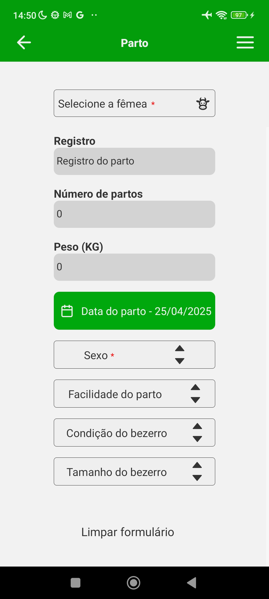

# SCL - Milk Control System

  <a href="#iphone-about-the-project">About the project</a>&nbsp;&nbsp;&nbsp;|&nbsp;&nbsp;&nbsp;
  <a href="#rocket-technologies">Technologies</a>&nbsp;&nbsp;&nbsp;|&nbsp;&nbsp;&nbsp;
  <a href="#login">Login</a>&nbsp;&nbsp;&nbsp;|&nbsp;&nbsp;&nbsp;
  <a href="#weighing">Weighing</a>

## :iphone: About the project

The Milk Control System is a tool developed for the Brazilian Association of Girolando Breeders to manage their breeders, cows, and milk production. This software belongs to the company Rerum.

The project was developed using React Native for the front-end and PostgreSQL with Ruby on Rails for the back-end. I was the sole developer responsible for both the back-end and the front-end.

## 📸 Gallery

<table>
  <tr>
    <td align="center">
      
    </td>
    <td align="center">
      
    </td>
    <td align="center">
      
    </td>
  </tr>
</table>

  

## :rocket: Technologies

To write the code:
-  [VS Code][vc] with [EditorConfig][vceditconfig], [ESLint][vceslint] and [Prettier][vcprettier]

#### The code itself
-  [React Navigation 6.x]()
    - react-navigation/native-stack
    - react-navigation/native
    - react-navigation/drawer
-  [React-Native](https://facebook.github.io/react-native/)
-  [Gesture Handler](https://kmagiera.github.io/react-native-gesture-handler/)
-  [Safe-Area-Context](https://github.com/th3rdwave/react-native-safe-area-context)
-  [Screens](https://github.com/software-mansion/react-native-screens)
-  [Exception-Handler](https://github.com/a7ul/react-native-exception-handler)
-  [Responsive-Screen](https://github.com/marudy/react-native-responsive-screen)
-  [AsyncStorage](https://github.com/react-native-community/async-storage)
-  [Styled-Components](https://www.styled-components.com/)
-  [Axios](https://www.npmjs.com/package/react-native-axios)
-  [Reanimated](https://github.com/software-mansion/react-native-reanimated)
-  [Vector-Icons](https://github.com/oblador/react-native-vector-icons)
-  [DateTimePicker](https://github.com/react-native-datetimepicker/datetimepicker)
-  [Redux & Redux-Persist](https://https://redux.js.org/introduction/getting-started)
-  [NetInfo](https://github.com/react-native-netinfo/react-native-netinfo)
-  [Date-Fns](https://github.com/date-fns/date-fns)
-  [Paper](https://reactnativepaper.com)
-  [Portalize](https://github.com/jeremybarbet/react-native-portalize)
-  [Animatable](https://https://github.com/oblador/react-native-animatable)
-  [Autocomplete-Input](Autocomplete-Input)
-  [Elements](https://reactnativeelements.com)
-  [Keyboard-Aware-Scroll-View](https://https://github.com/APSL/react-native-keyboard-aware-scroll-view)
-  [Linear-Gradient](https://github.com/react-native-linear-gradient/react-native-linear-gradient)
-  [Mask-Text](https://github.com/akinncar/react-native-mask-text)
-  [Numeric-Input](https://github.com/himelbrand/react-native-numeric-input)
-  [Shadow-2](https://github.com/SrBrahma/react-native-shadow-2)
-  [SVG](https://github.com/software-mansion/react-native-svg)
-  [Table-Component](https://github.com/Gil2015/react-native-table-component)
-  [Modalize](https://github.com/jeremybarbet/react-native-portalize)
-  [Moment](https://momentjs.com)

---

#### Made by Danilo José Lima de Oliveira ♥ 
#### [Get in touch!](https://www.linkedin.com/in/danilo-js/) with me 

[vc]: https://code.visualstudio.com/
[vceditconfig]: https://marketplace.visualstudio.com/items?itemName=EditorConfig.EditorConfig
[vceslint]: https://marketplace.visualstudio.com/items?itemName=dbaeumer.vscode-eslint
[vcprettier]: https://marketplace.visualstudio.com/items?itemName=esbenp.prettier-vscode