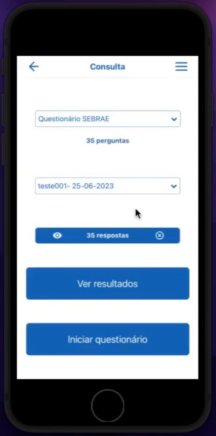

# SebraeApp

## :iphone: About the project

The SebraeApp, built with React Native, allows users to navigate through various customer forms, input responses to questions, and receive personalized recommendations and initiatives based on their responses. Additionally, the app provides the functionality to edit already submitted forms, consult results, and delete responses. I was the sole developer responsible for this frontend.

## 📸 Gallery

<table>
  <tr>
    <td align="center">
      
    </td>
    <td align="center">
      
    </td>
    <td align="center">
      
    </td>
  </tr>
</table>

  

---

#### Made by Danilo José Lima de Oliveira ♥ 
#### [Get in touch!](https://www.linkedin.com/in/danilo-js/) with me 