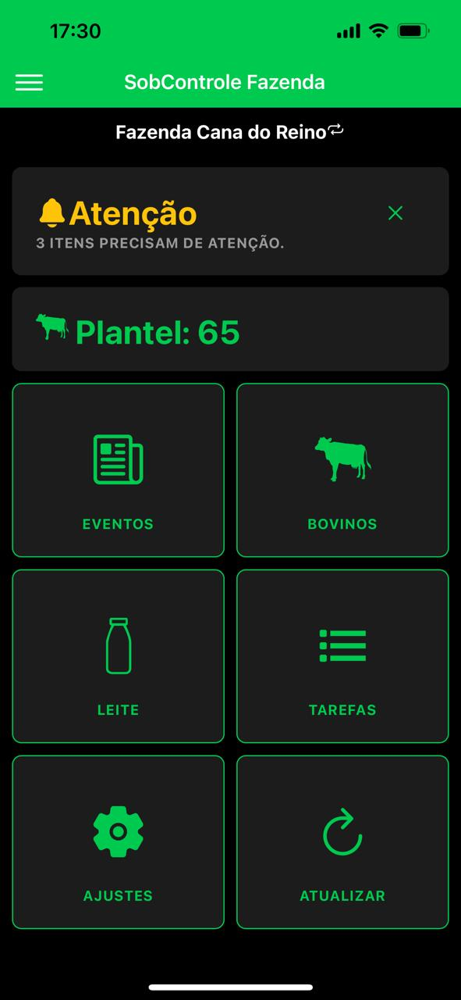
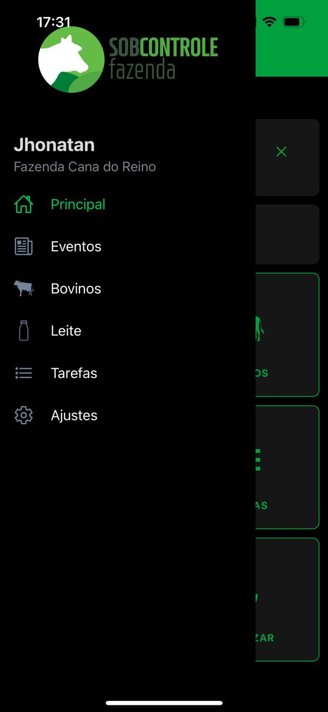
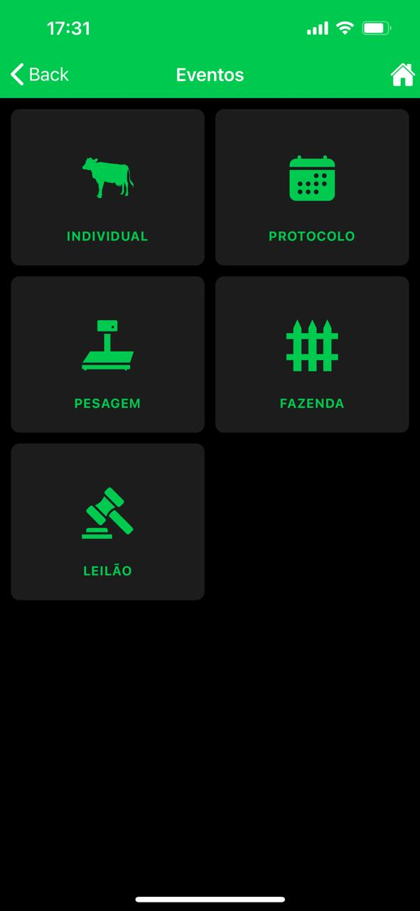
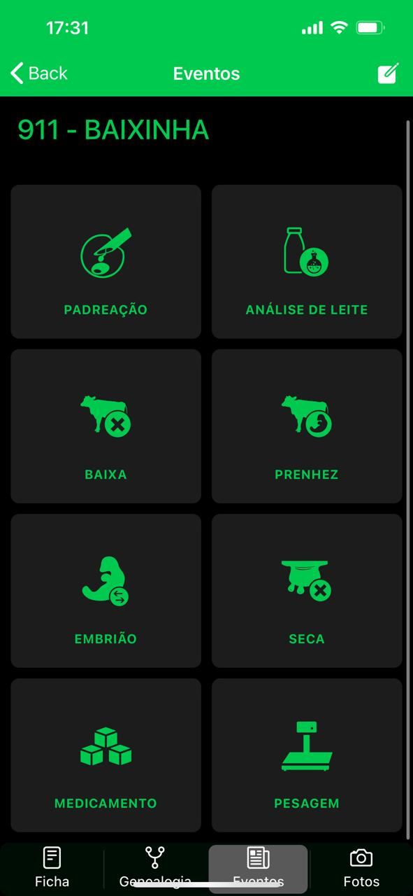

# SobControle

## :iphone: About the project

SobControle and SobControle Leite are innovative applications crafted to assist in farm and milk production management. Both apps are developed using Ionic and include specific modules tailored for managing farm operations and optimizing milk production. My role in the development of these applications was focused on maintenance and bug fixes, ensuring their smooth operation and reliability for users.

## 📸 Gallery

<table>
  <tr>
    <td align="center">
      
    </td>
    <td align="center">
      
    </td>
    <td align="center">
      
    </td>
    <td align="center">
      
    </td>
    <td align="center">
      
    </td>
  </tr>
</table>

---

#### Made by Danilo José Lima de Oliveira ♥ 
#### [Get in touch!](https://www.linkedin.com/in/danilo-js/) with me 

[vc]: https://code.visualstudio.com/
[vceditconfig]: https://marketplace.visualstudio.com/items?itemName=EditorConfig.EditorConfig
[vceslint]: https://marketplace.visualstudio.com/items?itemName=dbaeumer.vscode-eslint
[vcprettier]: https://marketplace.visualstudio.com/items?itemName=esbenp.prettier-vscode