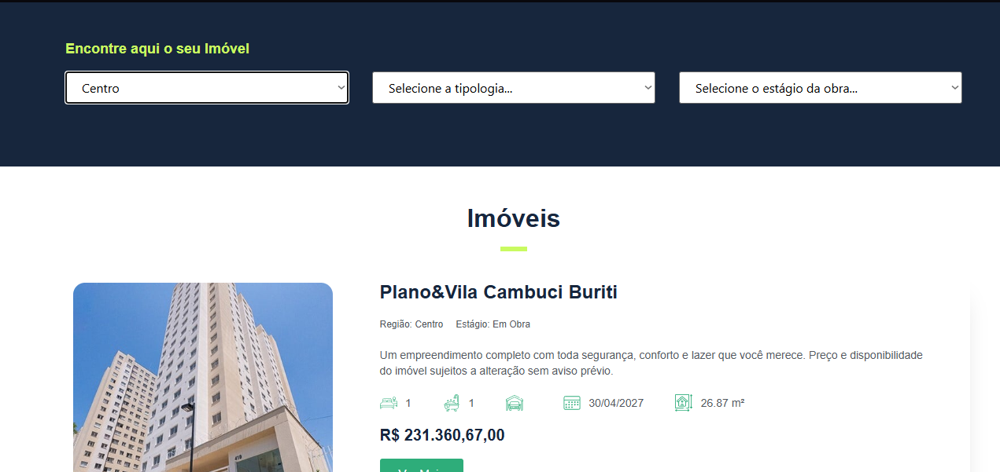
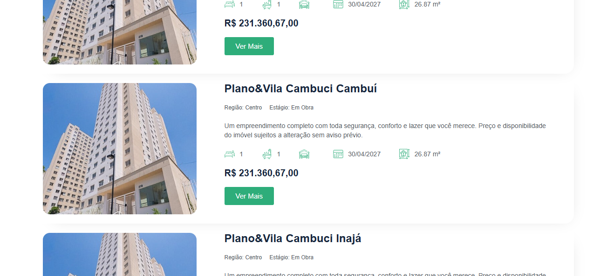

# Veon Casa

## :iphone: About the project

The Veon Casa project is a sophisticated real estate website built using PHP and WordPress. As a prominent member of the development team, I was responsible for creating custom plugins specifically tailored for this project. This platform is designed to facilitate the search and showcase of real estate properties to potential clients, offering innovative solutions and seamless integration to enhance the user experience.

## 📸 Gallery

<table>
  <tr>
    <td align="center">
       
    </td>
    <td align="center">
       
    </td>
  </tr>
</table>

  

---

#### Made by Danilo José Lima de Oliveira ♥ 
#### [Get in touch!](https://www.linkedin.com/in/danilo-js/) with me 

[vc]: https://code.visualstudio.com/
[vceditconfig]: https://marketplace.visualstudio.com/items?itemName=EditorConfig.EditorConfig
[vceslint]: https://marketplace.visualstudio.com/items?itemName=dbaeumer.vscode-eslint
[vcprettier]: https://marketplace.visualstudio.com/items?itemName=esbenp.prettier-vscode