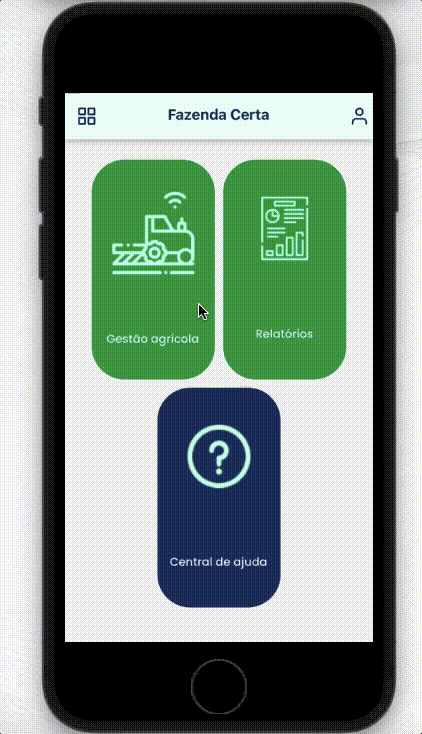

Switch to [english](https://github.com/Danilo-Js/My_Experience/blob/main/Readme.md)

  

  <a href="#balloon-o-que-é-isso">O que é isso?</a>&nbsp;&nbsp;&nbsp;|&nbsp;&nbsp;&nbsp;
  <a href="#easyfarm">Easyfarm</a>&nbsp;&nbsp;&nbsp;&nbsp;&nbsp;&nbsp;|&nbsp;&nbsp;&nbsp;
  <a href="#scl">SCL</a>&nbsp;&nbsp;&nbsp;

#

### Minha experiência

### :balloon: O que é isso?

Esta é uma compilação de projetos privados que desenvolvi.

#

### :iphone: Sobre os projetos

#### Easyfarm

A missão do EasyFarm é organizar todas as informações da fazenda em um só lugar, possibilitando a gestão de uma fazenda de forma completa, simples e organizada.
Essa gestão é feita através dos módulos: Atividade Agrícola, Abastecimento, Estoque, Manutenção, Ordens de Serviço, Compras e Pluviometria.
Há também a geração de relatórios para cada um dos módulos.

Ver [mais](https://github.com/Danilo-Js/My_Experience/blob/main/Easyfarm/portuguese.md)

  

#### SCL

O Sistema de Controle de Leite é uma ferramente feita para a Associação Brasileira de Criadores Girolando gerenciar seus criadores, vacas e produção de leite.
Este software percente a empresa Rerum.

Ver [mais](https://github.com/Danilo-Js/My_Experience/blob/main/SCL/portuguese.md)

  

---

#### Feito por Danilo José Lima de Oliveira ♥ 
#### [Entre em contato!](https://www.linkedin.com/in/danilo-js/) comigo 